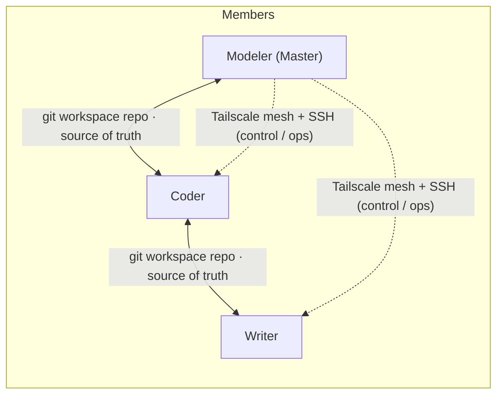

# MMCAS — Mathematical Modeling Competition Assistance System

**Make a three-member math-modeling team collaborate like a single mind.**

English | [中文](README.md)

[](LICENSE)


> Status: v1 has passed end-to-end internal testing (3 roles × 3 machines); v1.2 is in planning → [ROADMAP.md](ROADMAP.md)

## What is this

MMCAS is a collaboration system for **three-member mathematical modeling competition teams**. Each member = **one human + one AI agent (dsh)**, and the human can intervene at any moment. Three roles, three responsibilities:

- **Modeler (Master)** — problem analysis, model selection, task-card creation & dispatching, final verdicts
- **Coder** — implementation, experiments & numerical computing, reproducibility
- **Writer** — paper writing & typesetting, figures/tables, number traceability

Three design principles: **human-in-the-loop** (any milestone can be paused or rewritten), **never silently lose data** (sync conflicts are surfaced for human arbitration), **zero-registration one-click install** (member machines register nothing external).

## Features

- **Three role agents**: per-role persona, skills and tool boundaries.
- **Task-card DAG scheduling**: tri-state (todo/doing/done) + dependency gating (all deps done before start) + priority + atomic claiming; identical guardrails across CLI and panel; a task poller lets agents auto-claim ready work.
- **Shared workspace sync**: a private git repo is the single source of truth — workspace / task cards / memory files sync across all machines (daemon v0.2.1: auto commit/push, periodic pull, pre-commit health checks, conflict guard, stale-lock takeover).
- **Embedded dsh panel**: three drawers — Overview (devices / sync waterline / task poller), Task Board, Shared Memory. Not a standalone service; follows the host theme (light/dark).
- **Cross-machine control**: Tailscale mesh + SSH ops channel; firewall restricts to the Tailscale CIDR, and the Master cannot be controlled back.
- **Multi-provider APIs**: official APIs and relays with multi-URL / multi-key switching; a built-in `codex-bridge` connects channels that only accept the standard Codex client.
- **Environment sync**: lockfile + three-party consent + P2P wheelhouse — the receiver aligns offline (uv diffs and installs only what is missing; no mirror touching).
- **Capability-layer skills**: per-role skill sets (native dsh skills, loaded on demand), distilled from MIT-licensed community projects (see `docs/capability-design.md`).
- **Zero-registration one-click install**: one zip per member; double-click `setup.bat` and everything is automated (Tailscale up → SSH → portable Git/Node/uv → clone workspace → install dsh → generate config → autostart + shortcuts).

## Architecture



- **State sync**: private git repo over ssh.github.com:443 (stable across NAT)
- **Control channel**: Tailscale (WireGuard mesh; ACLs are the permission model)
- **Large files**: cloud drive (optional)

## Repository layout

```
docs/               Design docs & credential-exposure registry (template)
specs/              Task-card spec
packages/
  core/             Shared core: sync daemon, provider switcher, task-card guardrail, memory, SSH tools, setup
  dsh-panel-mmcas/  Embedded dsh panel plugin (Overview / Board / Memory)
  modeler/          Modeler bundle (role.md + skills/)
  coder/            Coder bundle (role.md + skills/)
  writer/           Writer bundle (role.md + skills/)
  common/           Shared skills (written into the workspace repo .dsh/skills/, synced via git)
scripts/            Packing / offline vendor download / resource index / debugging scripts
```

## Quick start

```bash
# Build a member bundle (deployer side)
node scripts/pack.mjs --role <coder|writer|modeler>

# Fetch offline components (Node / PortableGit / Tailscale / uv)
bash scripts/download-vendor.sh
```

On a member machine: unzip the bundle → double-click `setup.bat` (≈9 fully automated steps, failures summarized) → daily use via the `MMCAS-Agent` desktop shortcut.

> Packing assumes the deployer has prepared local credential config (**all external, zero plaintext in the repo** — see the template in `docs/secrets-registry.md`; member credentials are pre-generated and injected by the deployer).

## Docs

| File | Content |
|---|---|
| `docs/design.md` | Architecture & design decisions (**single source of truth**; change the doc before the code) |
| `docs/capability-design.md` | Capability-layer (skills) design |
| `specs/task-card.md` | Task-card format & scheduling rules |
| `ROADMAP.md` | Version plan (mirrored to Milestones / Issues) |

## Roadmap (v1.2 summary)

- **Scheduler core**: auto-claim poller into the mainline, fix duplicate/stale dispatch, remove the hard WIP cap (dependency gating is the rule)
- **Sessions & context**: enable dsh built-in compaction; new tasks open fresh sessions, reworked cards resume in their original session
- **Cross-end channel**: notices (decision requests / error reports / stop commands), return cards, rework flow
- **Independent audit instance**: one-click third-party audits for models / code / paper
- **Sync infra & packaging hardening**

See [ROADMAP.md](ROADMAP.md), [Milestones](https://github.com/xiangrui979/MMCAS/milestones) and the Issues.

## Privacy & Security

- **Zero plaintext in the repo**: all credentials live outside (covered by `.gitignore`, `*.example` placeholders only); every new credential channel must be registered in `docs/secrets-registry.md` first.
- **Zero registration**: member machines register no external services; credentials are pre-generated and individually revocable by the deployer.
- **Compliance posture**: the system contains no automatic AI labeling/disclosure features.

## Acknowledgements

- [DeepSeek Harness (dsh)](https://github.com/deepseek-ai/deepseek-harness) — the agent runtime
- Parts of the capability-layer skills are distilled from MIT-licensed community projects (see `docs/capability-design.md`)

## License

[MIT](LICENSE)
