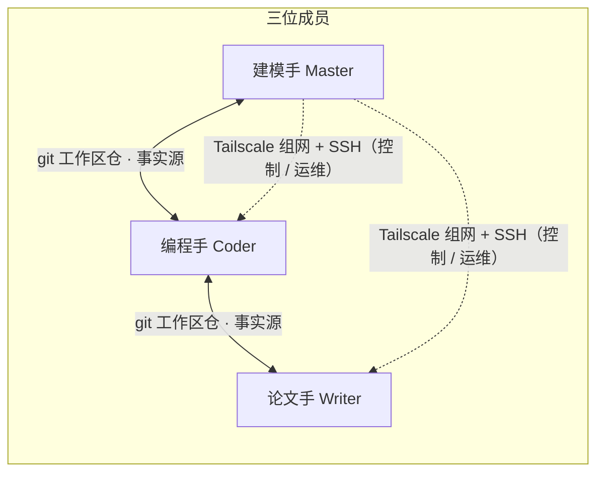

# MMCAS · 数学建模竞赛辅助系统

**Mathematical Modeling Competition Assistance System** —— 让三人数学建模小队像一个人一样协同。

[English](README.en.md) | 中文

[](LICENSE)


> 状态：v1.2 已完成全链路内测（实战修订：调度核心、会话与上下文、跨端通道、独立审计、同步基建、打包环境）→ [ROADMAP.md](ROADMAP.md)

## 这是什么

MMCAS 是面向**三人数学建模竞赛小队**的协同工作系统。每位成员 = **1 个人类 + 1 个 AI Agent（dsh）**，人类随时可干预。三个角色各司其职：

- **建模手（Master）**：问题分析、模型选择、任务卡创建与分派、关键结论终审
- **编程手**：代码实现、实验与数值计算、结果可复现
- **论文手**：论文撰写与排版、图表整合、数字溯源

三条设计原则：**人类在环**（关键节点可随时卡停/改写）、**永不静默丢数据**（同步冲突显式上报，人类裁决）、**零注册一键安装**（成员机不注册任何外部账号）。

## 功能特性

- **三角色 Agent**：各角色独立的提示词（persona）、技能与工具边界。
- **任务卡 DAG 调度**：三状态（todo/doing/done）+ 依赖门控（deps 全 done 才可开始）+ 优先级 + 原子认领；CLI 与面板双通道同护栏；任务轮询器支持 Agent 自动接取就绪任务。
- **共享工作区同步**：git 私有仓为唯一事实源——工作区 / 任务卡 / 记忆文件三端自动同步（守护进程 v0.2.1：自动 commit/push、定时 pull、入库前体检、冲突守卫、过期锁接管）。
- **dsh 内嵌面板**：总控（成员设备 / 同步水位 / 任务轮询器）、任务看板、共享记忆三个抽屉；不是独立服务，随 dsh 侧栏运行，自动跟随宿主明暗主题。
- **跨设备控制**：Tailscale 组网 + SSH 运维通道；防火墙只放行 Tailscale 网段，Master 不可被反向控制。
- **多 API 来源**：官方 API 与中转站多 URL / 多 key，一键切换；内置 `codex-bridge` 让"仅接受标准 Codex 客户端"的通道也能接入。
- **环境同步**：lockfile + 三方同意 + P2P wheelhouse——接收端离线对齐，uv 自动 diff 只装缺失（不碰镜像源）。
- **能力层 skills**：每角色专属技能集（dsh 原生 skills 机制，按需加载）；蒸馏整合自社区 MIT 建模 skill 生态（见 `docs/capability-design.md`）。
- **会话与上下文（v1.2）**：任务自动接取即开新会话（一卡一会话、打回回原会话续做）；上下文压缩三件套（自动压缩 / `/compact` / 溢出恢复）+ token 水位守门。
- **跨端通道（v1.2）**：notices 消息层（工作区 git 通道，紧急消息 steer 打断）+ 停止指令 + 回程卡（Slave→Modeler 受限建卡）+ 打回机制（done→todo 必填原因）。
- **独立审计（v1.2）**：面板「审计室」一键对数学模型 / 代码成品 / 最终论文发起第三方专家审计（经本地 codex-bridge），含预算守门（> ¥30 需确认）与桥健康可见。
- **同步守护看门狗（v1.2）**：同步心跳显性化（面板心跳行 + 停滞告警）；启动器自动确保守护进程在跑。
- **零注册一键安装**：每成员一个 zip 包，解压双击 `setup.bat` 全自动（Tailscale 上线 → SSH → 便携 Git/Node/uv → 克隆工作区 → 安装 dsh → 生成配置 → 自启 + 快捷方式）。

## 架构



- **状态同步**：git 私有仓（走 ssh.github.com:443，NAT 环境下稳定）
- **控制通道**：Tailscale（WireGuard 组网，ACL 即权限）
- **大文件**：网盘（可选）

## 仓库结构

```
docs/               设计文档与凭证暴露面登记（模板）
specs/              任务卡规范
packages/
  core/             共享核心：同步守护、provider 切换、任务卡护栏、记忆、SSH 工具、setup
  dsh-panel-mmcas/  dsh 内嵌面板插件（总控 / 看板 / 记忆）
  modeler/          建模手包（role.md + skills/）
  coder/            编程手包（role.md + skills/）
  writer/           论文手包（role.md + skills/）
  common/           三端共享 skills（写入工作区仓 .dsh/skills/，git 同步）
scripts/            打包 / 离线组件下载 / 资源索引生成 / 调试脚本
```

## 快速开始

```bash
# 生成成员包（部署者侧）
node scripts/pack.mjs --role <coder|writer|modeler>

# 下载离线组件（Node / PortableGit / Tailscale / uv）
bash scripts/download-vendor.sh
```

成员机：解压 zip → 双击 `setup.bat`（约 9 步全自动，失败自动汇总提示）→ 日常双击桌面 `MMCAS-Agent` 打开助手页面。

> 打包假定部署者已准备本机凭据配置（**全部外置、仓库零明文**——所有凭证位置与处理方式见 `docs/secrets-registry.md` 模板；成员机凭据由部署者预生成注入）。

## 文档

| 文件 | 内容 |
|---|---|
| `docs/design.md` | 架构与设计决策（**唯一事实源**，改架构先改文档） |
| `docs/capability-design.md` | 能力层（skills）设计 |
| `specs/task-card.md` | 任务卡格式与调度规则 |
| `ROADMAP.md` | 版本规划（与 Milestones / Issues 同步） |

## Roadmap（v1.2 摘要）

- **调度核心**：轮询器自动接取并入主线、修复重复/过期派发、去掉 WIP 硬限制（依赖门控为准）
- **会话与上下文**：启用 dsh 内置压缩；新任务自动开新会话、打回回原会话
- **跨端通道**：消息（裁决请求/错误上报/停止指令）、回程卡、打回机制
- **独立审计实例**：对模型 / 代码 / 论文成品的一键第三方审计
- **同步基建与打包加固**

详见 [ROADMAP.md](ROADMAP.md)、[Milestones](https://github.com/xiangrui979/MMCAS/milestones) 与 Issues。

## 隐私与安全

- **仓库零明文**：所有凭证外置（`.gitignore` 覆盖 + `*.example` 占位）；新增凭证渠道须先登记 `docs/secrets-registry.md`。
- **零注册**：成员机不注册任何外部服务，凭据由部署者统一预生成、可单独吊销。
- **合规姿态**：系统内不含任何自动 AI 标注/声明功能。

## 致谢

- [DeepSeek Harness (dsh)](https://github.com/deepseek-ai/deepseek-harness) —— Agent 运行时
- 能力层部分技能蒸馏自社区 MIT 开源项目（明细见 `docs/capability-design.md`）

## License

[MIT](LICENSE)
