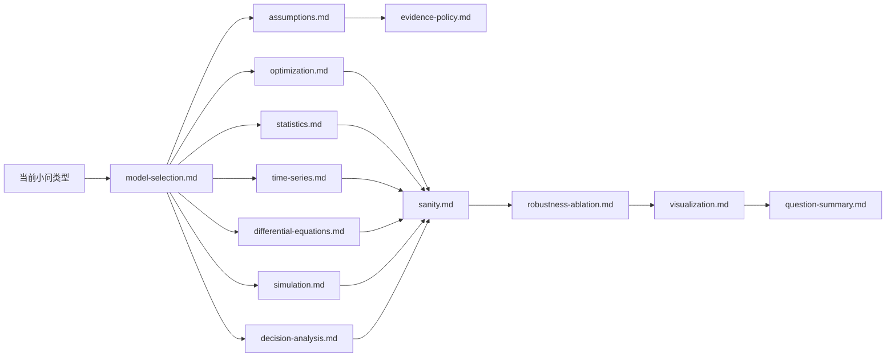

# AutoMM Knowledge

本目录是专职 Agent 的通用数学建模方法库，提供候选方法、适用边界、失败模式、检查清单和文献检索词。它不是当前赛题的证据库，也不是让 Agent 跳过推导的答案库。

## 证据边界

Knowledge 条目中的 `status: reviewed` 表示内容经过项目内部整理，不代表某篇文献已被当前题核验。关键假设、参数范围和核心公式用于具体赛题时，必须进入该小问的文献池/引用表，经 Crossref 或 OpenAlex 核验元数据，标记为 `verified` 和 `used`，并记录原文支持位置。

```text
题面硬约束
> 当前赛题 verified + used 文献
> 当前接受的假设和公式版本
> Knowledge 方法边界
> Agent 推理
```

## Agent 路由



按角色读取：problem-decomposer 读取术语和模型选择；literature-researcher 读取证据政策及相关检索词；assumption-manager 读取假设与证据；formulator 读取相关方法及 sanity；检查、鲁棒性、图表和总结角色读取各自专题。Agent 应按需读取，禁止把整个知识库无差别塞入上下文。

## 条目目录

- [`entry-template.md`](entry-template.md)：新增条目的统一结构；
- [`evidence-policy.md`](evidence-policy.md)：事实、假设、推断与引用规则；
- [`glossary.md`](glossary.md)：跨方法通用术语；
- [`assumptions.md`](assumptions.md)：假设分类、边界和版本化；
- [`model-selection.md`](model-selection.md)：从问题结构选择方法族；
- [`optimization.md`](optimization.md)：LP/MILP/NLP、多目标与不确定优化；
- [`statistics.md`](statistics.md)：回归、检验、降维、聚类和不确定性；
- [`time-series.md`](time-series.md)：预测、状态空间和变点；
- [`differential-equations.md`](differential-equations.md)：ODE/差分和数值稳定；
- [`simulation.md`](simulation.md)：蒙特卡洛、离散事件和排队；
- [`decision-analysis.md`](decision-analysis.md)：多指标评价、风险和排序；
- [`sanity.md`](sanity.md)：量纲、守恒、边界、数量级和一致性；
- [`robustness-ablation.md`](robustness-ablation.md)：敏感性、Bootstrap、情景和消融；
- [`visualization.md`](visualization.md)：出版级图表选择与误导检查；
- [`question-summary.md`](question-summary.md)：每小问总结的事实链与写作规范。

## 维护规则

新增条目使用模板，给出稳定 ID、适用/不适用条件、检查方法和检索词。方法结论发生实质变化时更新 `last_reviewed`。条目与题面或当前文献冲突时，以题面和已核验证据为准。
