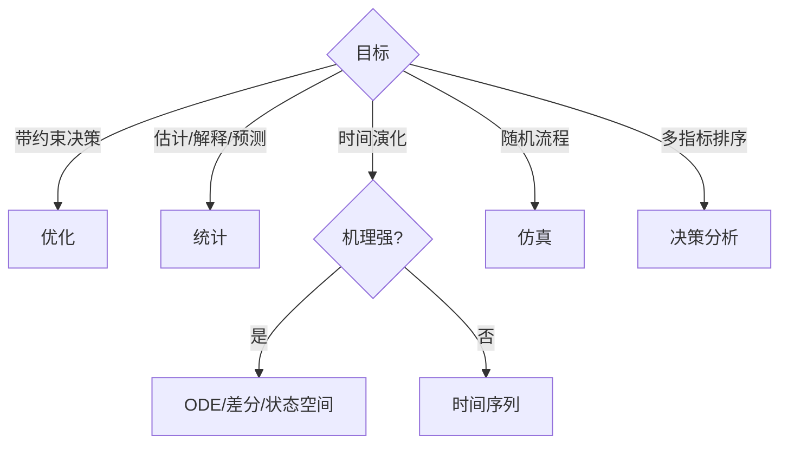

# 模型族选择

## 决策树

先判断目标是描述、解释、预测、优化、评价还是仿真；再识别动态性、连续/离散变量、硬约束、时空/网络结构和数据是否足以辨识参数。

## 最小完整基准

不设外部 leaderboard baseline，但需要一个能完整回答小问的简单模型作为内部对照。高级模型只有在解决非线性、整数性、异质性、动态反馈、不确定性或解释需求时才引入。基准和复杂模型必须使用同一数据、约束、指标与预算。

## 结构映射

- 线性目标/约束：LP；开关、分配、路径：MILP/网络优化；
- 光滑连续非线性：NLP；多目标：Pareto/ε-constraint；
- 连续响应：回归/广义线性；无标签结构：PCA/聚类；
- 时间依赖：ARIMA、动态回归、状态空间；
- 强机理动态：ODE/差分；随机事件：Monte Carlo/离散事件；
- 多指标评价：TOPSIS/AHP/效用模型并做权重敏感性。

## 组合与检查

组合模型先定义接口：统计模块估计什么，预测如何进入优化，仿真如何评估策略，前问输出如何携带单位、版本和不确定性。避免把多个流行算法串联却没有清晰数据流。

选择判据应在看结果前固定，包含硬约束、验证误差、稳定性、解释性、成本和对后问可用性。复杂度本身不是优点。

## 常见失败

小样本高容量模型；时间数据随机划分；整数决策连续求解后随意四舍五入；目标遗漏关键约束；评价权重决定一切但不做敏感性；机理参数不可辨识仍声称物理解释。

检索：`model selection framework`、`mechanistic vs statistical`、`hybrid modeling`、`benchmark model`、`out-of-sample validation`。
